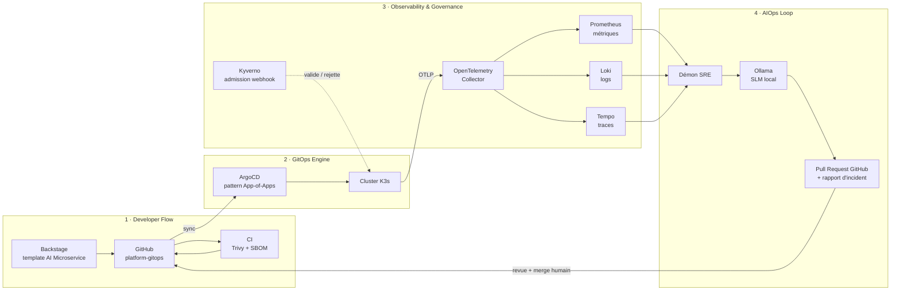

<div align="center">

# platform-gitops

### AI-Native Internal Developer Platform — Self-Service Kubernetes, GenAI Observability & Governed Agentic SRE


*Un développeur livre un microservice IA sécurisé et observable en 10 secondes.
Un agent SRE autonome surveille le cluster 24/7 et propose ses correctifs par Pull Request, jamais en direct.*

</div>

---

## Table des matières

1. [Le problème & la valeur métier](#1-le-problème--la-valeur-métier)
2. [Architecture](#2-architecture)
3. [Preuves visuelles](#3-preuves-visuelles)
4. [Architecture Decision Records](#4-architecture-decision-records-adrs)
5. [Stack (Bill of Materials)](#5-stack-bill-of-materials)
6. [Reproduire en 3 commandes](#6-reproduire-en-3-commandes)

---

## 1. Le problème & la valeur métier

### Le problème en entreprise

Déployer une API IA sécurisée et monitorée prend habituellement **plusieurs jours** : tickets réseau, IAM, Ingress, dashboards montés à la main. Et quand quelque chose tombe, il faut une intervention SRE manuelle, souvent hors des heures ouvrées.

### Ce que résout cette plateforme

| Phase | Avant | Avec `platform-gitops` |
|-------|-------|------------------------|
| **Day-0 / Day-1** | Tickets, allers-retours entre équipes, plusieurs jours | Un développeur remplit un formulaire dans le portail self-service et obtient un microservice IA sécurisé **en 10 secondes** |
| **Day-2** | Astreinte SRE manuelle | Un **démon SRE autonome** surveille le cluster 24/7 et soumet des **Pull Requests GitOps** soumises à validation humaine |

Principes directeurs : **tout passe par Git**, **rien n'est appliqué sans garde-fous**, **l'IA propose, l'humain décide**.

---

## 2. Architecture



**Les 4 flux :**

1. **Developer Flow** : Backstage → GitHub → CI (scan Trivy + génération du SBOM).
2. **GitOps Engine** : ArgoCD (pattern App-of-Apps) → K3s. Git est l'unique source de vérité.
3. **Observability & Governance** : les workloads émettent en OTLP vers l'OpenTelemetry Collector, qui route vers Tempo / Loki / Prometheus. Kyverno valide chaque ressource à l'admission.
4. **AIOps Loop** : le démon SRE lit la télémétrie, interroge un SLM local via Ollama, puis ouvre une Pull Request GitHub.

---

## 3. Preuves visuelles

> *Show, don't tell.* Chaque capture correspond à une promesse de la plateforme.

### 3.1 Self-service : le portail Backstage


Le formulaire du template **« AI Microservice »** : nom, modèle, ressources. Un clic, et le repo, le pipeline et les manifests GitOps sont générés.

### 3.2 Observabilité GenAI : traces dans Grafana Tempo


Vue en cascade d'une requête d'inférence : spans GenAI avec **TTFT** (time to first token) et **nombre de tokens prompt / completion**.

### 3.3 Gouvernance : Kyverno rejette le `hacker-pod`


Un pod non conforme est refusé à l'admission, avec un **message de rejet personnalisé en français** qui explique la règle enfreinte et comment la respecter.

### 3.4 Agentic SRE : la Pull Request #1 générée par l'agent


L'agent détecte l'incident, rédige un **rapport d'incident** et propose le correctif dans une PR GitHub. Un humain relit, discute, merge.

---

## 4. Architecture Decision Records (ADRs)

| # | Décision | Alternative écartée | Pourquoi | Compromis assumé |
|---|----------|---------------------|----------|------------------|
| 1 | L'agent IA propose des **Pull Requests GitOps** | `kubectl` direct depuis l'agent | Sécurité maximale, traçabilité Git complète, aucun risque d'action destructive issue d'une hallucination, principe du **Human-in-the-Loop** | Délai de remédiation plus long : il faut une revue humaine avant application |
| 2 | **Modèle local** (Qwen sur CPU via Ollama) | API cloud (OpenAI) | Souveraineté des données internes, **coût récurrent nul**, latence locale | Qualité de raisonnement et vitesse d'inférence inférieures à un grand modèle cloud |
| 3 | **OpenTelemetry Collector** | SDK vers un backend en direct | Découplage total du code applicatif vis-à-vis des backends de stockage, **neutralité fournisseur** | Un composant supplémentaire à opérer et à dimensionner |
| 4 | **Kyverno** | OPA Gatekeeper | Politiques en **YAML natif Kubernetes**, sans langage externe (Rego) à apprendre | Moins expressif que Rego pour des règles très complexes |

---

## 5. Stack (Bill of Materials)

| Rôle | Outil | Justification |
|------|-------|---------------|
| **Runtime Kubernetes** | K3s | Distribution CNCF légère, adaptée à un cluster compact, tout en restant conforme Kubernetes |
| **Portail développeur** | Backstage | Standard de fait des IDP : catalogue et templates self-service |
| **GitOps** | ArgoCD (App-of-Apps) | Réconciliation déclarative continue, Git comme source de vérité, bootstrap reproductible |
| **Runtime IA** | Ollama + Qwen (CPU) | Inférence locale, sans dépendance cloud, sans coût par requête |
| **Observabilité** | OpenTelemetry Collector, Tempo, Loki, Prometheus, Grafana | Traces, logs et métriques unifiés, backends interchangeables |
| **Gouvernance & sécurité** | Kyverno | Policy-as-code à l'admission, messages de rejet explicites |
| **Supply chain** | Trivy + SBOM | Scan de vulnérabilités et inventaire des composants à chaque build |
| **AIOps** | Démon SRE + SLM local | Détection et proposition de correctifs 24/7, sous validation humaine |

---

## 6. Reproduire en 3 commandes

**1. Cloner le repo**

```bash
git clone https://github.com/<your-user>/platform-gitops.git
cd platform-gitops
```

**2. Explorer l'arborescence GitOps**

```bash
tree apps/
```

<!-- TODO : coller ici la sortie réelle de `tree apps/` -->

**3. Tester une inférence en direct via l'Ingress**

```bash
curl -s http://<ingress-host>/api/generate \
  -d '{
    "model": "<qwen-model>",
    "prompt": "Explique le GitOps en une phrase.",
    "stream": false
  }'
```

---

<div align="center">

**Clément Trecourt** · DevSecOps & Platform Engineering

</div>
